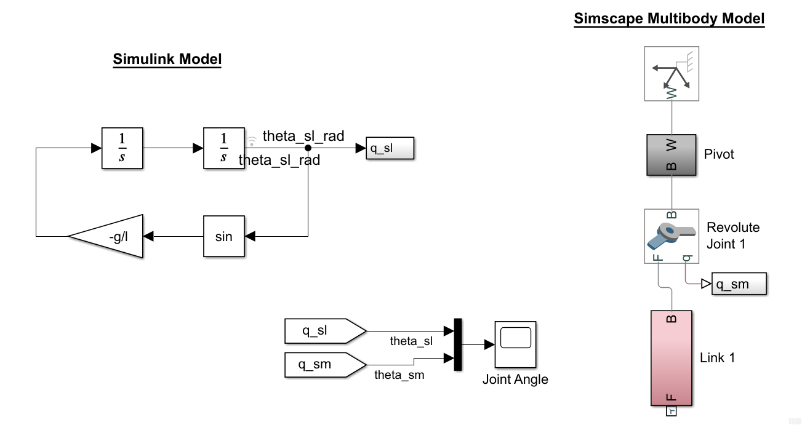

👨‍🔬 Modeling a Pendulum in MATLAB
=================================

This repository contains the material required to support the hands-on that walks you through the basic steps
for modeling a physical system in MATLAB/Simulink.

| |
| :---: |
|  |
|  |

### 🔢 Basic Steps
1. Sketch out the system on the paper and derive the **governing equations**.
2. Solve the **ODE problem** in MATLAB.
3. **Simplify modeling** by using Simulink.
4. Don't model it, just **build it** and **show it** in Simscape.
5. Carry out a **back-to-back comparison**.
6. Building a **double pendulum** is as easy as counting 1,2,3.
7. Let's **control** the pendulum.
8. Perpetual motion doesn't exist actually, better off **damping the pendulum**.

With MATLAB you can design, simulate, and implement controllers for more complicated systems such as an [inverted pendulum](https://mathworks.com/videos/inverted-pendulum-control-with-simmechanics-and-quarc-106862.html).

### 🎓 Assignment
Copy out `step_8.slx` into `step_9.slx`. Then, use `step_9.slx` to develop a controller that will let the pendulum rotate at a constant velocity.  

To complete the assignment do:
1. [Fork][1] this repository to your own account. The following actions are to be taken in your forked repository.
1. [Create the branch][2] `solution` off of the branch `master`.
1. [Commit][3] into the branch `solution` the following files:
    1. the model `step_9.slx`;
    1. a screenshot of the graph of the angle velocity.
1. [Push][4]/sync the changes up to GitHub.
1. [Create a pull request][5] (**PR**) with `master` as _base branch_ and `solution` as _compare branch_. ⚠ Be careful that the base branch needs to be the one in your fork.
1. [Request to review your PR][6] 👋 to turn in the assignment.

[1]: https://help.github.com/en/github/getting-started-with-github/fork-a-repo
[2]: https://help.github.com/articles/creating-and-deleting-branches-within-your-repository
[3]: https://git-scm.com/docs/git-commit
[4]: https://help.github.com/articles/pushing-to-a-remote
[5]: https://help.github.com/articles/creating-a-pull-request
[6]: https://help.github.com/articles/requesting-a-pull-request-review
